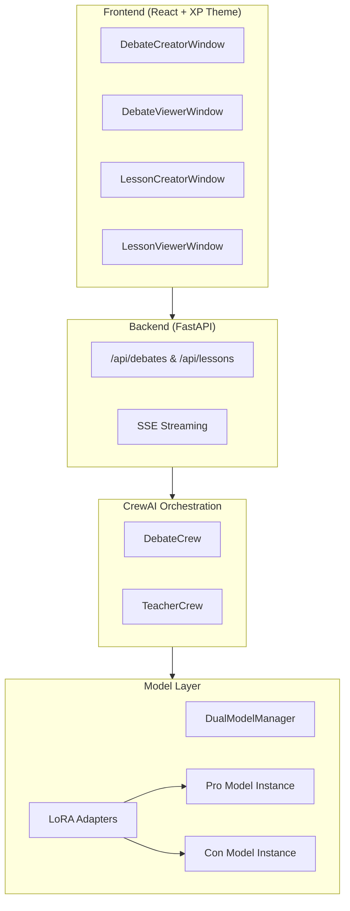
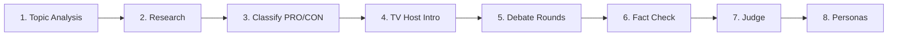

# Debate Simulator - Architecture Report

## Executive Summary

The Debate Simulator is a multi-agent AI system built with CrewAI, featuring dual LLM instances with dynamic LoRA adapter loading. It supports two main modes: **Debate Mode** (AI vs AI or Human vs AI) and **Teaching Mode** (educational content generation).

---

## System Architecture Overview



---

## 1. Model Management

### DualModelManager
**File:** [dual_model_manager.py](file:///home/remote-core/project/debate-simulator-nomotron/src/crew/utils/dual_model_manager.py)

Manages two independent LLM instances for parallel argument generation:

| Property | Description |
|----------|-------------|
| `model_pro` | Pro debater's model instance |
| `model_con` | Con debater's model instance |
| `current_adapter_pro` | Currently loaded adapter for Pro |
| `current_adapter_con` | Currently loaded adapter for Con |

**Key Methods:**
- `load_adapter(model_key, domain)` - Dynamically loads LoRA adapters
- `generate_pro(prompt, ...)` - Generate text using Pro model
- `generate_con(prompt, ...)` - Generate text using Con model
- `unload_adapters()` - Revert to base models

### Available Adapters

| Domain | Path | Use Case |
|--------|------|----------|
| `debate` | models/adapters/debate | Argumentation & rhetoric |
| `education` | models/adapters/education | Teaching & explanation |
| `medicine` | models/adapters/medicine | Medical topics |
| `ecology` | models/adapters/ecology | Environmental topics |

---

## 2. Agents

### 2.1 Debate Pipeline Agents

#### Topic Analyst Agent
**File:** [topic_analyst.py](file:///home/remote-core/project/debate-simulator-nomotron/src/crew/agents/topic_analyst.py)

**Purpose:** Pre-processes the debate topic
- Grammar/spelling correction
- Key term extraction  
- Domain detection
- Research query optimization
- Persona query generation

**Output:** `TopicAnalysis` dataclass with corrected topic, domain, and optimized queries

---

#### Research Analyst Agent
**File:** [research_analyst.py](file:///home/remote-core/project/debate-simulator-nomotron/src/crew/agents/research_analyst.py)

**Purpose:** Classifies research into debate-ready format
- Sorts snippets into PRO/CON/FACT categories
- Extracts statistics with sources
- Calculates quality score
- Formats context per debater stance

**Output:** `ClassifiedResearch` with pro_points, con_points, key_facts

---

#### TV Host Agent
**File:** [tv_host_agent.py](file:///home/remote-core/project/debate-simulator-nomotron/src/crew/agents/tv_host_agent.py)

**Purpose:** Introduces the debate
- Domain-specific welcome message
- Topic context
- Format explanation
- Uses template or LLM generation

---

#### Router Agent
**File:** [router_agent.py](file:///home/remote-core/project/debate-simulator-nomotron/src/crew/agents/router_agent.py)

**Purpose:** Classifies topic domain for adapter selection
- Returns domain + confidence score
- Domains: economics, politics, environment, technology, etc.

---

#### Debater Agents (Pro & Con)
**File:** [debater_agents.py](file:///home-remote-core/project/debate-simulator-nomotron/src/crew/agents/debater_agents.py)

**Purpose:** Generate debate arguments
- Uses stance-specific context
- Maintains debate history
- Responds to opponent's arguments

---

#### Fact-Check Agent
**File:** [factcheck_agent.py](file:///home/remote-core/project/debate-simulator-nomotron/src/crew/agents/factcheck_agent.py)

**Purpose:** Verifies argument accuracy
- Computes faithfulness score (0-1)
- Checks claims against research context
- Returns verification results per side

---

#### Judge Agent
**File:** [judge_agent.py](file:///home/remote-core/project/debate-simulator-nomotron/src/crew/agents/judge_agent.py)

**Purpose:** Evaluates debate and declares winner
- Scores arguments (0-100)
- Considers fact-check results
- Returns `JudgeScore` with winner, scores, reasoning

---

#### Persona Agent
**File:** [persona_agent.py](file:///home/remote-core/project/debate-simulator-nomotron/src/crew/agents/persona_agent.py)

**Purpose:** Recommends real-world expert guests
- Searches Wikipedia for notable people
- Validates that results are actual persons
- Infers likely stance and credentials

---

### 2.2 Teaching Mode Agent

#### Teacher Agent
**File:** [teacher_agent.py](file:///home/remote-core/project/debate-simulator-nomotron/src/crew/agents/teacher_agent.py)

**Purpose:** Generates structured educational lessons
- Creates overview, key concepts, examples
- Generates quiz questions
- Adapts to detail level (beginner/intermediate/advanced)

---

## 3. Tools

### WikipediaSearchTool
**File:** [wikipedia_tool.py](file:///home/remote-core/project/debate-simulator-nomotron/src/crew/tools/wikipedia_tool.py)

| Search Type | Description |
|-------------|-------------|
| `summary` | Get Wikipedia article summary |
| `full` | Get full article content |
| `search` | Search for related articles |
| `experts` | Find notable people on topic |

---

### InternetResearchTool
**File:** [internet_research.py](file:///home-remote-core/project/debate-simulator-nomotron/src/crew/tools/internet_research.py)

| Search Type | Description |
|-------------|-------------|
| `debate` | Gather pro/con arguments + facts |
| `general` | General topic research |
| `experts` | Find domain experts |

**Features:**
- Session-based caching
- Auto-refinement loop with quality evaluation
- DuckDuckGo search backend

---

### ResearchEvaluator
**File:** [research_evaluator.py](file:///home/remote-core/project/debate-simulator-nomotron/src/crew/tools/research_evaluator.py)

**Purpose:** Scores research quality (0-100)
- Checks topic relevance
- Measures specificity (numbers, dates)
- Verifies perspective diversity
- Suggests refined queries if below threshold

---

### DebateGenerationTool
**File:** [debate_tool.py](file:///home/remote-core/project/debate-simulator-nomotron/src/crew/tools/debate_tool.py)

**Purpose:** Generates debate arguments
- Builds prompts with research context
- Maintains conversation history
- Cleans output (removes markdown, meta-commentary)
- Enforces sentence limits

---

## 4. Orchestration

### DebateCrew (8-Step Pipeline)
**File:** [debate_crew.py](file:///home/remote-core/project/debate-simulator-nomotron/src/crew/debate_crew.py)



| Step | Agent/Tool | Output |
|------|-----------|--------|
| 1 | Topic Analyst | Corrected topic, queries |
| 2 | InternetResearchTool | Raw research context |
| 3 | Research Analyst | PRO/CON classified data |
| 4 | TV Host | Introduction message |
| 5 | Debater Agents | Pro/Con arguments |
| 6 | Fact-Check Agent | Faithfulness scores |
| 7 | Judge Agent | Winner & scores |
| 8 | Persona Agent | Expert recommendations |

---

### TeacherCrew (4-Step Pipeline)
**File:** [teacher_crew.py](file:///home/remote-core/project/debate-simulator-nomotron/src/crew/teacher_crew.py)

| Step | Description |
|------|-------------|
| 1 | Classify domain |
| 2 | Gather research (Wikipedia + Internet) |
| 3 | Load education adapter |
| 4 | Generate structured lesson |

---

## 5. API Endpoints

### Debate API
| Endpoint | Method | Description |
|----------|--------|-------------|
| `/api/debates` | POST | Create new debate |
| `/api/debates` | GET | List all debates |
| `/api/debates/{id}` | GET | Get debate details |
| `/api/debates/{id}/stream` | GET | SSE progress stream |

### Lesson API
| Endpoint | Method | Description |
|----------|--------|-------------|
| `/api/lessons` | POST | Create new lesson |
| `/api/lessons` | GET | List all lessons |
| `/api/lessons/{id}` | GET | Get lesson details |
| `/api/lessons/{id}/stream` | GET | SSE progress stream |

---

## 6. Data Flow Example (Debate)

```
User Input: "immigration to europe"
    ↓
Topic Analyst → "Immigration to Europe" (corrected)
    ↓
Research Tool → Raw text from web/Wikipedia
    ↓
Research Analyst → {
  pro_points: ["Economic benefits...", ...],
  con_points: ["Cultural challenges...", ...],
  key_facts: [{content, source}, ...]
}
    ↓
TV Host → "Welcome! Tonight we discuss..."
    ↓
Pro Model (debate adapter) → Argument for immigration
Con Model (debate adapter) → Argument against immigration
    ↓ (repeat for N rounds)
Fact-Checker → {pro: 0.85, con: 0.78}
    ↓
Judge → {winner: "pro", pro_score: 72, con_score: 68}
    ↓
Persona Agent → [Expert 1, Expert 2, ...]
```

---

## 7. Key Design Decisions

1. **Dual Model Architecture**: Two independent model instances allow different adapters for each stance
2. **Lazy Loading**: Models only load when first accessed to reduce startup time
3. **SSE Streaming**: Real-time progress updates to frontend via Server-Sent Events
4. **Quality Refinement Loop**: Research automatically re-queries if quality score is too low
5. **Output Cleaning**: Aggressive post-processing removes LLM artifacts (markdown, instructions)
6. **Modular Agents**: Each agent has single responsibility, enabling easy testing/replacement
